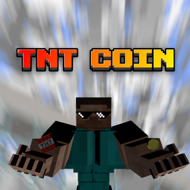
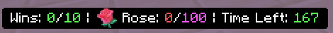
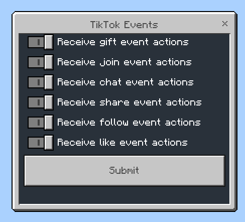
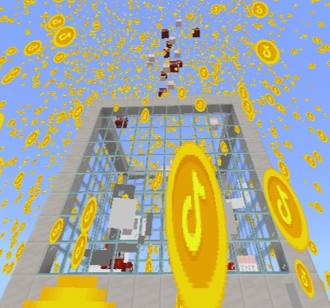
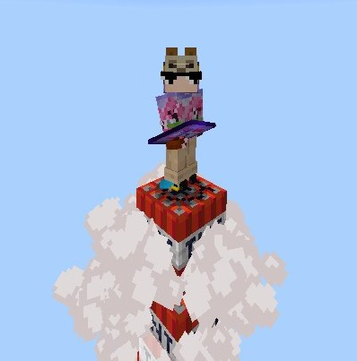
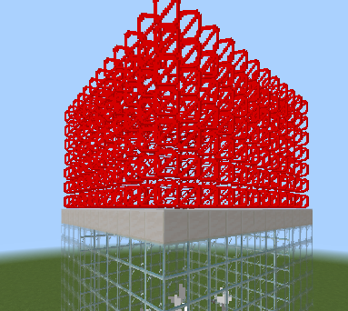

<div align="center">



# TNT Coin

THE ULTIMATE INTERACTIVE TNT CHALLENGE FOR MINECRAFT BEDROCK AND POCKET EDITION


</div>

TNT Coin is a Minecraft BE/PE add-on designed to make it easy for players to set up and run the Minecraft TNT Challenge. This challenge, popularized on TikTok live streams, involves players trying to fill a structure with blocks while viewers send virtual gifts that spawn TNT, causing chaos and destruction.

# Overview

- [🌟 Core Features](#-core-features)
  - [TNT Coin Menu](#tnt-coin-menu)
  - [TNT Box](#tnt-box)
  - [Gift Goal](#gift-goal)
  - [Events and Actions](#events-and-actions)
  - [Countdown](#countdown)
  - [Timer](#timer)
  - [TNT Coin Rain](#tnt-coin-rain)
  - [TNT Rocket](#tnt-coin-rocket)
  - [Jail](#tnt-coin-jail)
  - [Structure Builder Mode](#structure-builder-mode)
  - [Summon Entities](#summon-entities)
  - [Structure Barriers](#structure-barriers)
  - [Filling Structure](#filling-structure)
  - [Randomized Block Placement](#randomized-block-placement)
- [Adding Custom Sounds](#adding-custom-sounds)
- [Custom Overlay](#overlay)
- [TikTok Gifts Emoji](#tiktok-gifts-emoji)
- [Download](#download)
- [Bridging TikTok Live and Minecraft with BedrockLive](#bridging-your-tiktok-live-and-minecraft-with-bedrocklive)
- [Contributing](#contributing)
- [License](#license)

## 🌟 Core Features

### TNT Coin Menu

Simply open your inventory, navigate to the Items tab, and search for "TNT Coin", and right click to open the GUI.


### TNT Box

- Players can select the base, side, corner block types for the structure.
- The width and height of the structure can be customized.


### Gift Goal

The Gift Goal System in TNT Coin allows you to set specific gift targets for your live stream.

- Choose from available gifts with emojis, set the desired target count, and toggle the display on or off as needed.
- To enable live tracking of gift goals, connect your Minecraft world to [TikTokLiveMCBE](https://github.com/rqinix/TikTokLiveMCBE), a WebSocket server. This connection ensures that as viewers send gifts during your TikTok live stream, the progress towards the goal is updated on the action bar.




### Events and Actions

TNT Coin listens for specific script events (e.g., `tntcoin:join`) received from the [BedrockLive](https://www.npmjs.com/package/bedrocklive)

#### TNT Coin currently handles six TikTok events

1. Member
2. Follow
3. Share
4. Chat
5. Like
6. Gift

TNT Coin display messages when these events got triggered by default. You can disable them in TNT Coin Settings.



#### Actions available that you can assign to events

1. Summon
2. Fill
3. Clear Blocks
4. Play Sound
5. Screen Title
6. Screen Subtitle
7. Run Command
8. Jail
9. TNT Coin Rain
10. TNT Rocket

### TNT Coin Rain

Activate TNT Coin Rain through the TNT Coin Menu. You can configure the rain's intensity to reduce the number of particles and TNTs spawned, and you have the option to change which entities TNT Rain will summon. By default, TNT Coin Rain spawns TikTok coin particles and shakes your camera - both effects can be disabled during TNT Coin Rain configuration. TNT Coin Rain can be stopped at any time during the rain event and can also be used as an event action.



### TNT Coin Rocket

TNT Coin rocket makes you fly like a rocket in a specified duration while it summons TNT. TNT Rocket can also be use as event action. You can also configure its speed before launching.



### TNT Coin Jail

TNT Coin jail locks you in a cage that prevents you from placing blocks in specified amount of time. You get blindness effect by default, this can also be disable in TNT Coin Settings. TNT Coin Jail can also be use as event action.

### Countdown

- When the structure is completely filled, a countdown begins. The countdown determines if the player wins the round.
- During the countdown, the player’s camera can be configured to rotate around the structure.
- Players can also configure the starting point of the countdown. Once the countdown ends, the player wins the round.

### Timer

- Players can start, stop, and restart at any time.
- Players can configure the timer’s duration.
- If you run out of time, you will LOSE!
- The timer can be displayed on the action bar.


### Summon Entities

- Summon any entities within the structure.
- Summon TNT

### Structure Builder Mode

With structure builder mode being enable, you can modify or destroy the blocks of TNT Coin Box. Enable it by unlocking the Structure in TNT Coin Menu.

### Structure Barriers

Enable/Disable Barriers in TNT Coin Menu.



### Filling Structure

Players can also fill the structure through TNT Coin Menu. Fill action can also be use as event action. All Fill configurations can be fount in TNT Coin Settings.

### Randomized Block Placement

- This feature allows players to place a random block from a predefined list whenever they use a specific item in the game.
- Update the `RANDOM_BLOCK_ITEM` to the desired item ID.
- Modify the `BLOCKS` array from `scripts/config/tiktok.js` file to include any block IDs you want to be randomly selected when the specified `RANDOM_BLOCK_ITEM` is used.

```ts
/**
 * The item that will be used to place random block.
 */
config.setConfig("RANDOM_BLOCK_ITEM", "minecraft:amethyst_block");

/**
 * List of possible blocks when placing random blocks.
 */
config.setConfig("BLOCKS", [
    "minecraft:pink_wool",
    "minecraft:magenta_wool",
    "minecraft:orange_wool",
    "minecraft:lime_wool",
    "minecraft:yellow_wool",
]);
```

## Adding Custom Sounds

To add custom sounds, ensure your files are in `.ogg` format and place them in your **resource pack** in your desired directory (e.g., `sounds/meme/`). Then, define them in the `sounds/sound_definitions.json` file.

Below is an example of how to structure your custom sounds:

```json
{

  "vine_boom": {
      "category": "meme",
      "sounds": ["sounds/meme/vine_boom"]
  },

  "your_custom_sound": {
      "sounds": ["path/to/your/sound"]
  }

}
```

## Overlay

Replace the `overlay.png` file located at `TNTCoinRP/textures/tnt-coin/overlay.png` with your own custom overlay image. Ensure they still have the same file name `overlay`.

```
tnt-coin/
┣ gui/
┃ ┗ buttons/
┣ items/
┣ particles/
┗ overlay.png
```

## TikTok Gifts Emoji


Below are some of the TikTok gifts that have emoji. Each gift comes with its own emoji and coin value.

| Gift Name                 | Emoji | Coins |
|---------------------------|-------|-------|
| Gimme The Vote            |      | 1     |
| Community Fest            |      | 1     |
| Music Play                |      | 1     |
| GG                        |      | 1     |
| Ice Cream Cone            |      | 1     |
| Rose                      |      | 1     |
| TikTok                    |      | 1     |
| Thumbs Up                 |      | 1     |
| Heart                     |      | 1     |
| Cake Slice                |      | 1     |
| Love you                  |      | 1     |
| Football                  |      | 1     |
| Rainbow                   |      | 1     |
| Flame heart               |      | 1     |
| Birthday Cake             |      | 1     |
| Heart Puff                |      | 1     |
| Heart Me                  |      | 1     |
| Team Bracelet             |      | 2     |
| Finger Heart              |      | 5     |
| Potato                    |      | 5     |
| Smart                     |      | 5     |
| Ladybug                   |      | 5     |
| Tofu                      |      | 5     |
| Applause                  |      | 9     |
| Cheer You Up              |      | 9     |
| Friendship Necklace       |      | 10    |
| Rosa                      |      | 10    |
| Tiny Diny                 |      | 10    |
| ASMR Time                 |      | 10    |
| Horseshoe                 |      | 10    |
| Cherry Blossom Bunny      |      | 10    |
| Perfume                   |      | 20    |
| Doughnut                  |      | 30    |
| Sign language love        |      | 49    |
| Butterfly                 |      | 88    |
| Family                    |      | 90    |
| Sending strength          |      | 90    |
| Fist bump                 |      | 90    |
| Paper Crane               |      | 99    |
| Little Crown              |      | 99    |
| Cap                       |      | 99    |
| Hat and Mustache          |      | 99    |
| Honorable Person          |      | 99    |
| Breakthrough Star         |      | 99    |
| Kiss your Heart           |      | 99    |
| Hot Shot                  |      | 99    |
| Guitar                    |      | 99    |
| Like-Pop                  |      | 99    |
| Birthday Crown            |      | 99    |
| Self care mask            |      | 99    |
| Community Crown           |      | 99    |
| Star                      |      | 99    |
| Confetti                  |      | 100   |
| Hand Hearts               |      | 100   |
| Hand Heart                |      | 100   |
| Bear love                 |      | 100   |
| Marvelous Confetti        |      | 100   |
| Socks and Sandals         |       | 150   |
| Sunglasses                |      | 199   |
| Hearts                    |      | 199   |
| Lock and Key              |      | 199   |
| Garland Headpiece         |      | 199   |
| Love You                  |      | 199   |
| Cheer For You             |      | 199   |
| Jungle Hat                |      | 199   |
| Goalkeeper Save           |      | 199   |
| Sending positivity        |      | 199   |
| Meerkat                   |      | 199   |
| Birthday Glasses          |      | 199   |
| Stinging Bee              |      | 199   |
| Massage for You           |      | 199   |
| Pinch Face                |      | 249   |
| Boxing Gloves             |      | 299   |
| Duck                      |      | 299   |
| Corgi                     |      | 299   |
| Dash                      |      | 299   |
| Superpower                |      | 299   |
| Elephant trunk            |      | 299   |
| TikTok Crown              |      | 299   |
| Fruit Friends             |      | 299   |
| Play for you              |      | 299   |

## Download

> [!IMPORTANT]
>
> **Requirement:** Enable "Beta APIs" in your world settings for this add-on to function correctly.
> **Version:** This add-on is designed for Minecraft BE/PE version **1.21.22+**. Ensure your game is updated to this version or later for the best experience.

**_Show your support by giving it a ⭐!_**

- [Download TNT Coin](https://github.com/rqinix/TNTCoin/releases)

> **Optional:** After importing the TNT Coin Resource Pack and Behavior Pack into Minecraft, move them from the `resource_packs` and `behavior_packs` folders to the `development_resource_packs` and `development_behavior_packs` folders inside the `com.mojang` directory. This step ensures that any changes or modifications you make to the TNT Coin packs are applied to any of your worlds.

## Bridging your TikTok Live and Minecraft with BedrockLive

If you want to connect your TikTok live stream to Minecraft and trigger in-game actions like automatically dropping TNT when someone sends a gift you'll need to setup [BedrockLive](https://github.com/rqinix/BedrockLive).

See here: [BedrockLive](https://github.com/rqinix/BedrockLive)

## Contributing

Feel free to contribute by submitting issues or pull requests. Any improvements or new features are welcome!

## License

This project is licensed under the terms of the [MIT License](./LICENSE).
