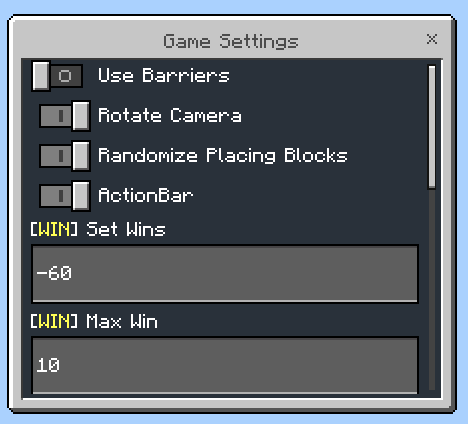

<div align="center">


# TNT Coin

Experience the Minecraft TNT Challenge with TNT Coin!


</div>

TNT Coin is a Minecraft BE/PE add-on designed to make it easy for players to set up and run the Minecraft TNT Challenge. This challenge, popularized on TikTok live streams, involves players trying to fill a structure with blocks while viewers send virtual gifts that spawn TNT, causing chaos and destruction. 

## Download

> [!IMPORTANT]
> **Requirement:** Enable "Beta APIs" in your world settings for this add-on to function correctly.
> **Version:** This add-on is designed for Minecraft BE/PE version **1.21.22**. Ensure your game is updated to this version or later for the best experience.

**_Show your support by giving it a ⭐!_**
- [Download Resource Pack](https://github.com/rqinix/RP-TNT-Coin/releases)
- [Download Behavior Pack](https://github.com/rqinix/BP-TNT-Coin/releases)

> **Note:** After importing the TNT Coin Resource Pack and Behavior Pack into Minecraft, make sure to move them from the `resource_packs` and `behavior_packs` folders to the `development_resource_packs` and `development_behavior_packs` folders in the `com.mojang` directory. This ensures that any changes you make during development are reflected immediately in-game.

> **Note:** This is an early release, so you might encounter some unexpected behavior. We appreciate your patience and feedback as we continue to improve TNT Coin! 


## 🌟 Core Features

### Graphical User Interface (GUI)

- Simply open your inventory, navigate to the Items tab, and search for "TNT Coin", and right click to open the GUI.


### Structure Creation

- Players can select the base and side block types for the structure.
- The width and height of the structure can be customized.


### Settings



#### Barrier Generation

- Enable/Disable Barriers in settings.


#### Block Filling

- Players can specify which block type should be used for filling in settings.
- Players can start and stop the block filling process at any time.
- Players can modify the speed of filling process in settings.

#### Countdown

- When the structure is filled, a countdown begins, determining if the player wins or loses the round.
- During the countdown, the player’s camera can be set to rotate around the structure.
- Players can configure where to start counting down.

#### Randomized Block Placement

- This feature allows players to place a random block from a predefined list whenever they use a specific item in the game.
- Update the `RANDOM_BLOCK_ITEM` to the desired item ID.
- Modify the `BLOCKS` array from `scripts/config/config.js` file to include any block IDs you want to be randomly selected when the specified `RANDOM_BLOCK_ITEM` is used.

```ts
/**
 * The item that will be used to place random block.
 */
export const RANDOM_BLOCK_ITEM = 'minecraft:amethyst_block';

/**
 * List of possible blocks when placing random blocks.
 */
export const BLOCKS = [
    'minecraft:stone',
    'minecraft:dirt',
    'minecraft:grass',
    'minecraft:diamond_block',
    'minecraft:emerald_block',
    'minecraft:gold_block',
    'minecraft:iron_block',
    "minecraft:pink_wool",
    // ... add more blocks
];
```

### Timer

- Players can start, stop, and restart at any time.
- Players can configure the timer’s duration.
- If you run out of time, you will LOSE!
- The timer can be displayed on the action bar.


### Summon Entities

- Summon any entities within the structure.
- Summon TNT
- Summon Lightning Bolt: This randomly striking or destroying any type of blocks within the structure.

### Play Sound


- You can easily modify the sounds available in the game by editing also the `scripts/config/config.js` file.

```ts
/**
 * List of sounds that you can play
 */
export const SOUNDS = [
    {
        name: 'Totem',
        sound: 'random.totem' // sound id
    },
    // ... add more sounds
]
```

### Save and Load Game State

### Gift Goal

The Gift Goal System in TNT Coin allows you to set specific gift targets for your live stream.

- Choose from available gifts with emojis, set the desired target count, and toggle the display on or off as needed.
- To enable live tracking of gift goals, connect your Minecraft world to [TikTokLiveMCBE](https://github.com/rqinix/TikTokLiveMCBE), a WebSocket server. This connection ensures that as viewers send gifts during your TikTok live stream, the progress towards the goal is updated on the action bar.


### Events

- The game listens for specific script events (e.g., `tntcoin:join`) received from the WebSocket server.
- Players can enable or disable specific event actions.


## Using WebSocket

If you want to connect your TikTok live stream to Minecraft and trigger in-game actions like automatically dropping TNT when someone sends a gift you'll need to set up a WebSocket server. 

See here: [TikTokLiveMCBE](https://github.com/rqinix/TikTokLiveMCBE)

## Contributing

Feel free to contribute by submitting issues or pull requests. Any improvements or new features are welcome!

## License

This project is licensed under the terms of the [MIT License](./LICENSE).
