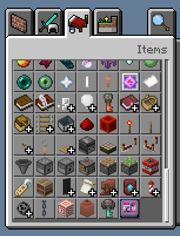
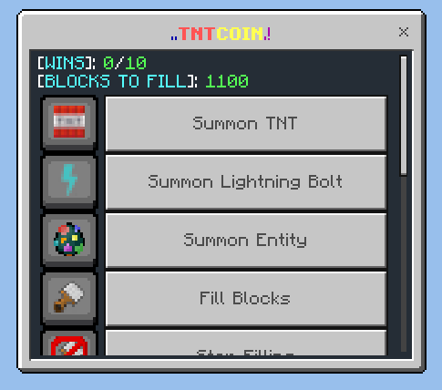
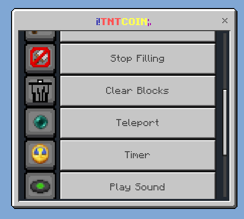
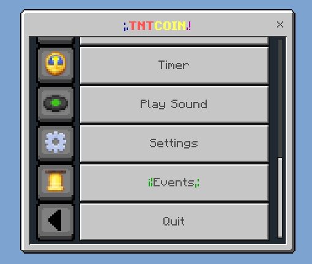
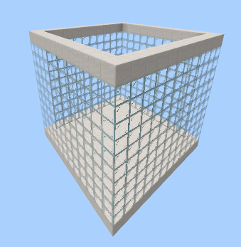
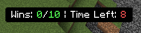
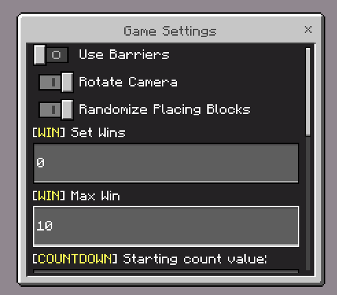
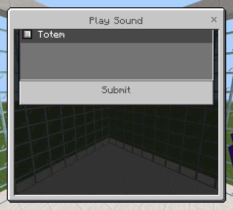

<div align="center">


# TNT COIN


</div>

TNT Coin is a Minecraft BE/PE add-on, inspired by a popular trend on TikTok live streams known as the Minecraft TNT Challenge. In this challenge, streamers try to build or maintain a structure while their viewers send virtual gifts that spawn TNT, causing chaos and destruction.

TNT Coin is designed to make it easy for Minecraft BE/PE players to set up and run the Minecraft TNT Challenge.

## 🌟Features
### Graphical User Interface (GUI)

- Simply open your inventory, navigate to the Items tab, and search for "TNT Coin".



<br>



<br>



<br>




### Structure Creation

- Players can select the base and side block types for the structure.
- The width and height of the structure can be customized.




### Barrier Generation

- Enable/Disable Barriers

### Block Filling

- Players can specify which block type should be used for filling.
- Players can start and stop the block filling process at any time.

### Timer

- Players can start, stop, and restart at any time.
- The timer can be displayed on the action bar.



- Players can configure the timer’s duration.
- If you run out of time, you will LOSE!

### Countdown

- When the structure is filled, a countdown begins, determining if the player wins or loses the round.
- During the countdown, the player’s camera can be set to rotate around the structure.
- Players can configure where to start counting down.

### Summon Entities

- Summon any entities within the structure.
- Summon TNT
- Summon Lightning Bolt: This randomly striking or destroying any type of blocks within the structure.

### Wins/Loses

- Players can edit their wins and adjust the maxixum win.
- Tracks player wins and determines when the player reaches the maximum win threshold.
- Use timer to lose.

### Randomized Block Placement

- This feature allows players to place a random block from a predefined list whenever they use a specific item in the game.



- Update the `RANDOM_BLOCK_ITEM` to the desired item ID.
- Modify the `BLOCKS` array from `scripts/config/config.js` file to include any block IDs you want to be randomly selected when the specified `RANDOM_BLOCK_ITEM` is used.

```ts
/**
 * The item that will be used to place random block.
 */
export const RANDOM_BLOCK_ITEM = 'minecraft:amethyst_block';

/**
* List of possible blocks when placing random blocks.
*/
export const BLOCKS = [
    'minecraft:stone',
    'minecraft:dirt',
    'minecraft:grass',
    'minecraft:diamond_block',
    'minecraft:emerald_block',
    'minecraft:gold_block',
    'minecraft:iron_block',
    "minecraft:pink_wool",
    // ... add more blocks
];
```

### Play Sound



- You can easily modify the sounds available in the game by editing also the `scripts/config/config.js` file.

```ts
/**
 * List of sounds that you can play
    */
export const SOUNDS = [
    {
        name: 'Totem',
        sound: 'random.totem'
    },
    {
        name: 'LevelUp',
        sound: 'random.levelup'
    },
    {
        name: ' ... '
        sound: ' ... '
    },
    // ... add more sounds
]
```

### Save and Load Game State

- Save player's settings.

### Events

- The game listens for specific script events (e.g., `tntcoin:join`) received from the WebSocket server.
- Players can enable or disable specific events.

## Using WebSocket

If you want to connect your TikTok live stream to Minecraft and trigger in-game actions like automatically dropping TNT when someone sends a gift you'll need to set up a WebSocket server. 

See here: [TikTokLiveMCBE](https://github.com/rqinix/TikTokLiveMCBE)

## Contributing

Feel free to contribute by submitting issues or pull requests. Any improvements or new features are welcome!